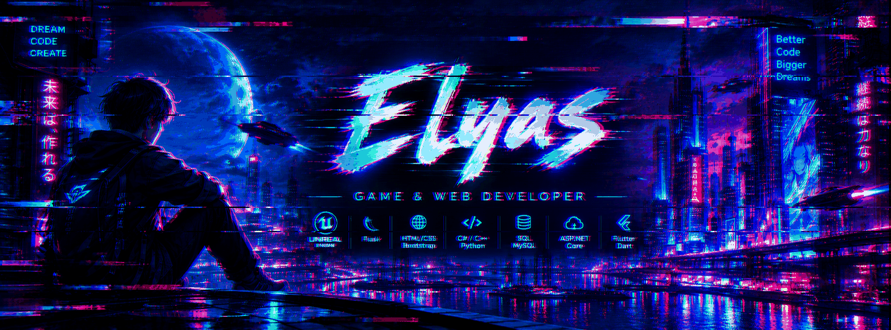

<!--
<p align="center">
  
</p>
-->

<p align="center">
  
</p>

<p align="center">
  
</p>

<h1 align="center">👋 Hey, I'm Elyas</h1>

<p align="center">
  <b>Software Developer · Game Developer · Builder</b>
</p>

<p align="center">
  Building software, interactive systems, and worlds.
</p>

---

## 🧠 About Me

I'm a Computer Engineering graduate and a developer interested in building things that people can actually use — from web platforms and backend systems to games and interactive experiences.

My development journey started primarily around **Python, Flask, C# and web development**, and has gradually expanded into **C++, Unreal Engine, Unity and game development**.

I enjoy understanding how things work under the hood, building systems from scratch, and turning ideas into working projects.

```text
Software Development
        │
        ├── Backend & Web
        │     ├── Python / Flask
        │     ├── C# / ASP.NET Core
        │     └── SQL / REST APIs
        │
        └── Game Development
              ├── C++ / Unreal Engine
              ├── C# / Unity
              ├── 2D Animation / Spine
              └── 3D / Blender
```

---

## 🛠️ Technologies & Tools

### 💻 Programming

<p align="left">
  
  
  
</p>

### 🌐 Web & Backend

<p align="left">
  
  
  
  
  
</p>

### 🎮 Game Development

<p align="left">
  
  
  
  
</p>

### ⚙️ Development & Infrastructure

<p align="left">
  
  
  
  
</p>

### 🎨 Art & Animation

<p align="left">
  
  
  
</p>

---

## 🚀 Featured Projects

### 🏢 Karimi Part

A full-stack platform developed for an automotive parts distribution business.

**Focus:** real-world business software, backend development, administration and maintenance.

**Stack:**
`Python` · `Flask` · `SQLAlchemy` · `Jinja2` · `Bootstrap` · `SQL`

---

### 🎮 Blue Devil

A personal indie game project built around **gameplay, character animation and narrative storytelling**.

The project combines interactive gameplay with a cinematic story and original characters, with a focus on creating a distinctive visual and emotional identity.

**Technologies & Tools:**
`Unity` · `C#` · `Spine` · `Photoshop`

> Currently exploring the intersection of gameplay, animation and cinematic storytelling.

---

### ⚔️ Unreal Engine Projects

A collection of C++ projects built while studying and experimenting with Unreal Engine.

Exploring:

* Gameplay architecture
* C++ and Unreal Engine APIs
* Character and pawn systems
* State machines
* Input systems
* Damage and interaction systems
* AI and gameplay mechanics
* Object-oriented game architecture

**Stack:**
`C++` · `Unreal Engine` · `Blueprints`

---

### 📱 Flutter Projects

Mobile applications built while working with Flutter and Dart, including business-oriented applications and REST-based backend integration.

**Stack:**
`Flutter` · `Dart` · `REST API` · `Flask`

---

## 🧩 What I Like Building

```text
        ┌───────────────────────────────┐
        │           Ideas               │
        └───────────────┬───────────────┘
                        ↓
              ┌─────────────────┐
              │   Architecture  │
              └────────┬────────┘
                       ↓
             ┌───────────────────┐
             │      Systems      │
             └─────────┬─────────┘
                       ↓
              ┌─────────────────┐
              │   Interaction   │
              └────────┬────────┘
                       ↓
             ┌───────────────────┐
             │   Experiences     │
             └───────────────────┘
```

I'm particularly interested in:

* 🧱 Backend architecture and APIs
* 🎮 Gameplay systems
* 🧠 Game architecture and state machines
* 🎬 Interactive storytelling
* 🎨 Character animation
* ⚙️ Tools and developer utilities
* 🔧 Turning ideas into working software

---

## 🌱 Currently Exploring

* **Unreal Engine & C++**
* Gameplay programming and architecture
* 3D workflows with Blender
* Game animation and cinematic systems
* Better software architecture and design patterns
* Building and shipping complete projects

---

## 📊 GitHub Activity

<p align="center">
  
</p>

<p align="center">
  
</p>

---

<p align="center">
  
</p>
